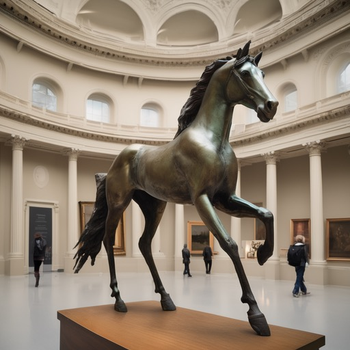

# ML project

## Table of contents
- [Table of contents](#table-of-contents)
- [Installation](#installation)
- [Examples](#examples)
- [Acknowledgments](#acknowledgments)

## Installation
1. Clone the repository
2. Install poetry using https://python-poetry.org/docs/
3. ```poetry install```

## Examples
"A polygonal illustration of a cat and a bunny" (move bunny to (0.9, 0.9))

  

"A photo of sharks in the ocean" (move sharks to (0.1, 0.1))

  

"A photo of a bronze horse in a museum" (size(bronze horse)*2.0)

  

"A photo of rubber ducks walking on street" (size(rubber ducks)*0.5)

  

## Acknowledgments
The Demo.ipynb is based on the following notebook: https://colab.research.google.com/drive/1SEM1R9mI9cF-aFpqg3NqHP8gN8irHuJi?usp=sharing

Some code will be rewritten and some methods will be added in the future.
